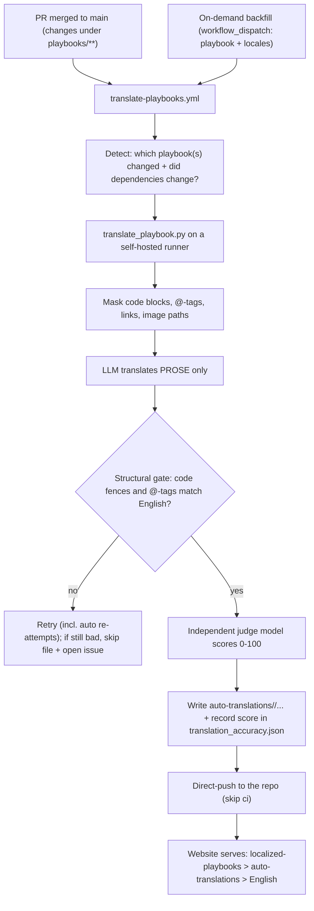

<!--
Copyright Advanced Micro Devices, Inc.

SPDX-License-Identifier: MIT
-->

# Auto-Translated Playbooks

This directory holds **automatically generated** localized copies of the
playbooks. Each `<locale>/` subtree mirrors the layout of the top-level
[`playbooks/`](../playbooks/) folder so the two are easy to compare.

> [!IMPORTANT]
> Do not hand-edit files under `auto-translations/`. They are regenerated by the
> [`translate-playbooks.yml`](../.github/workflows/translate-playbooks.yml)
> workflow. For human-reviewed translations, use
> [`localized-playbooks/`](../localized-playbooks/) instead - those take
> precedence over these when both exist for a locale.

---

## How the automatic translation flow works



### 1. Trigger
The [`translate-playbooks.yml`](../.github/workflows/translate-playbooks.yml)
workflow runs when:
- **A PR merges to `main`** touching `playbooks/**` (a new or edited playbook, or
  a changed shared dependency file). This is the maintenance path.
- **On-demand backfill** via *Run workflow* (`workflow_dispatch`) - optionally
  for one playbook, otherwise **all** playbooks; defaults to all 30 languages.
  This fires the same automated pipeline (used to re-translate everything after a
  model change or when adding a language).

### 2. Detect what to translate
On a merge, the workflow diffs the commit and translates **only** the affected
playbook(s). If any `playbooks/dependencies/*.md` changed, it also retranslates
the shared dependency content (used by the `@require`/`@setup` dropdowns).

### 3. Translate (prose only) on a self-hosted runner
The job runs on a self-hosted runner labeled `translation` so it can reach the
configured LLM API endpoint while the repository stays public. For each file,
[`translate_playbook.py`](../.github/scripts/translate_playbook.py):
1. **Masks** everything that must not change - fenced/inline code, the
   `@os`/`@device`/`@require`/`@setup`/`@test`/`@github-only` tags, Markdown
   links, image paths, and the license header - replacing them with
   placeholders.
2. Sends only the remaining **prose** to the model (`temperature=0`, pinned
   model) with a system prompt + a **do-not-translate glossary**
   ([`glossary.json`](../.github/scripts/glossary.json)) that locks brand/product
   terms (AMD, Ryzen AI, ComfyUI, ROCm, ...).
3. **Restores** the placeholders verbatim.
Only `README.md`, `platform.md`, the shared `dependencies/*.md`, and the
`title`/`description` from `playbook.json` are translated.

`@github-only` blocks are masked **whole**, so their body stays in English rather
than being translated. The website strips these blocks outright, so GitHub is the
only place they render, and letting the model rewrite one risks corrupting the
markers the strip keys on. To restore the English block in translations produced
before this rule, run `--sync-github-only` (below).

### 4. Automatic quality gate (no human review)
- **Structural gate:** the number and order of code fences and `@`-tags in the
  output must match the English source, and every placeholder must be restored.
  On mismatch it retries at higher temperature and, for large files, re-translates
  section-by-section. Any files still failing after the main pass are re-attempted
  automatically (`--retries`, default 2) since these misses are usually stochastic;
  only files still broken after that are **skipped (never committed broken) and a
  tracking issue is opened** that tags the maintainer.
- **Quality score:** an independent judge model (ideally stronger than the
  translator) scores each file 0-100 (MQM/GEMBA). The score is recorded in the
  locale's `translation_accuracy.json` (see [below](#the-translation_accuracyjson-file)).
  Low-scoring files get one higher-temperature retry.

### 5. Idempotent + resumable
Each file's English source hash, translator model, judge model, prompt version,
and score are stored in `translation_accuracy.json`. A file is **re-translated**
only when its English source, translator model (`LLM_MODEL`), or prompt version
changes; if only the **judge model** (`LLM_JUDGE_MODEL`) changes, the existing
translation is **re-scored** in place (no re-translation). Everything else is
skipped - so re-runs are cheap and an interrupted run resumes cleanly.

### 6. Publish
The workflow commits the results under `auto-translations/` and **direct-pushes**
them (`[skip ci]`). These files are documentation overlays: `test-playbooks.yml`
only runs on `playbooks/**`, so translations are never executed or tested.

### 7. Resolution at render time
The website resolves each file per locale in this order:
**`localized-playbooks/<locale>/` (human) → `auto-translations/<locale>/` (machine)
→ `playbooks/` (English fallback).**

---

## Machine-translation disclaimer

Every translated `README.md` / `platform.md` gets a localized caution at the very
top - machine-translated, may contain mistakes, some instructions/commands/downloads
or product availability may differ by language or region, and the original English
version of the playbook controls in the event of any discrepancy. It is inserted right
after the license header (outside `@github-only`, so it renders on **both** GitHub
and the website, which already renders `> [!WARNING]` alerts), wrapped in a marker
for idempotent insert/refresh:

```
<!-- auto-translated-disclaimer v2 -->
> [!WARNING]
> <localized text>
<!-- auto-translated-disclaimer:end -->
```

- **Text** lives in [`disclaimers.json`](../.github/scripts/disclaimers.json): a
  canonical `en` string plus a curated per-locale `locales` map and a `version`.
  English is the fallback for any missing locale. Bump `version` to force every
  block to refresh on the next apply.
- **Injection** happens in `translate_playbook.py` after scoring, so the disclaimer
  never affects the quality score. It is applied only to `README.md`/`platform.md`,
  not the shared `dependencies/*.md` snippets.
- **Human-authored `localized-playbooks/` are exempt.** The disclaimer is only ever
  written into `auto-translations/`; the script never touches `localized-playbooks/`.
  And because render-time resolution is `localized-playbooks/` -> `auto-translations/`
  -> English, a file a human localized is served **without** the disclaimer, while
  the machine-translated fallback for any file they haven't localized still shows it.
- **Metadata flag:** each translated `playbook.json` carries `"auto_translated": true`
  so the website / other consumers can detect machine-translated content.
- **Backfill / refresh:** `python .github/scripts/translate_playbook.py --apply-disclaimers`
  inserts or refreshes the disclaimer and sets the flag across existing translations
  without re-translating. It is idempotent (defaults to all present locales). The
  sibling `--sync-github-only` does the same for `@github-only` blocks, restoring the
  verbatim English block (and dropping any stray prefix a model left on the opening
  marker, which would otherwise survive the website's strip and render on the page).

---

## The engine: which LLM, which API, and how it's called

All translation and scoring is done by [`translate_playbook.py`](../.github/scripts/translate_playbook.py).
There is no SDK and no third-party dependency - it makes a plain HTTPS `POST` to a
**configurable LLM API endpoint**. Because the endpoint, models, and auth are all
supplied via a handful of `LLM_*` settings, it can run against any compatible API
(self-hosted or private) - so the model text stays on infrastructure you control.

> [!NOTE]
> **Environment variables vs. GitHub secrets - they're the same values, in two
> places.** The script itself only ever reads **environment variables**
> (`os.environ["LLM_MODEL"]`, etc.); it knows nothing about GitHub. GitHub
> Actions **secrets** are just *where those values are stored* for CI: the
> [`translate-playbooks.yml`](../.github/workflows/translate-playbooks.yml)
> workflow copies each secret into the job's environment (`LLM_MODEL: ${{ secrets.LLM_MODEL }}`),
> so the script sees them as plain env vars. So you **set them once as repository
> secrets** for CI; when running locally you just export the same `LLM_*` env
> vars in your shell. The table below lists that shared set of names.

| What | Env var (set as a GitHub secret for CI) | Notes |
|------|---------------------|-------|
| **Translator model** | `LLM_MODEL` | A capable large language model. |
| **Judge / scorer model** | `LLM_JUDGE_MODEL` | A separate, independent model (ideally stronger) used only to score quality, to reduce self-evaluation bias. |
| **API format** | `LLM_PROVIDER` | `anthropic` (Messages API, `POST <base>/v1/messages`) or `openai` (`/chat/completions`). |
| **Endpoint (base URL)** | `LLM_BASE_URL` | The LLM API to call. |
| **Auth** | `LLM_EXTRA_HEADERS` | A JSON map of extra request headers (e.g. an API-management subscription key), as your endpoint requires. |
| **Sampling** | (in code) | `temperature=0`; retries bump temperature only to fix placeholder/quality issues. |

The client is provider-agnostic - nothing about the endpoint, models, or auth is
hard-coded; it all comes from environment variables, so you point it at whichever
compatible LLM API you run.

**Exactly how one file is translated:**
1. Read the English file from `playbooks/…`.
2. **Mask** everything that must not change (code fences, inline code, the
   `@os`/`@device`/`@require`/`@setup`/`@test`/`@github-only` HTML-comment tags,
   Markdown links, image paths, and the license header) with sentinel tokens.
3. `POST` the masked prose to `<base>/v1/messages` with the translator model,
   `temperature=0`, a system prompt, and the do-not-translate glossary
   ([`glossary.json`](../.github/scripts/glossary.json)).
4. **Restore** the masked spans and run the structural gate (fences + tags must
   match; all sentinels restored).
5. Second `POST` to the **judge model** with the source + translation to get the
   0-100 quality score, recorded in `translation_accuracy.json`.

**Where it runs:** the script runs on a dedicated self-hosted runner (labeled
`translation`) via [`translate-playbooks.yml`](../.github/workflows/translate-playbooks.yml),
which reads the `LLM_*` values from repository **secrets** - fully automated, with
no manual translation step. See the next section.

---

## Production readiness & CI rollout

### Status

| Capability | Status |
|------------|--------|
| Translation engine (mask -> LLM -> restore) | Implemented |
| Structural gate (code/tags preserved) + auto retry | Implemented |
| Independent quality score per file (`translation_accuracy.json`) | Implemented |
| Idempotent + resumable (source-hash manifest) | Implemented |
| `localized-playbooks/` override + region-only playbooks | Implemented |
| GitHub Actions workflow: triggers, detect-changed, direct-push, all 30 locales | Implemented |
| Provider-agnostic client (Anthropic-style / OpenAI-compatible APIs) | Implemented |
| **Dedicated self-hosted runner labeled `translation`** | Implemented |
| **`LLM_*` repository secrets set** | Implemented |
| Website language selector for end users | Out of scope (website team) |

The runner and secrets are now in place, so the workflow runs automatically: a
push to `main` touching `playbooks/**` translates the changed playbook(s) into all
locales and direct-pushes the results - no code changes and no manual step.

> [!NOTE]
> Everything below refers to one workflow file,
> [`.github/workflows/translate-playbooks.yml`](../.github/workflows/translate-playbooks.yml),
> and to this repo's GitHub **Settings**. Line numbers are approximate - search
> for the quoted key if they've shifted.

### What the runner infrastructure needs to provide (CI / infra team)
1. **Register a dedicated self-hosted runner** in
   **Settings → Actions → Runners → New self-hosted runner** (or an org-level
   runner group scoped to this repo). During registration, give it the
   **`translation`** label so it matches the workflow's target (the `self-hosted`
   label is applied automatically, so you don't need to add it):
   ```yaml
   # .github/workflows/translate-playbooks.yml  (~line 45)
   runs-on: translation
   ```
   If you use a different label, change that `runs-on:` line to match (see
   maintainer step 2).
2. **A persistent, dedicated machine is fine here** - it does not need to be
   ephemeral. Persistent self-hosted runners are normally discouraged on public
   repos because untrusted fork PRs could run on them, but this workflow only
   triggers on trusted events (push to `main` + manual dispatch; never fork PRs -
   see maintainer step 3), so a dedicated always-on runner is safe.
3. **Runner image prerequisites:** network egress to the configured LLM API
   endpoint (`LLM_BASE_URL`) plus `github.com`/PyPI, any required **TLS/proxy CA**
   trusted (so HTTPS to the endpoint works), and **Python 3.13 + git**
   (the workflow's `actions/setup-python` step pins `3.13`).

### What the repository maintainers need to do (GitHub admin)
1. **Add the `LLM_*` values as GitHub Actions secrets:**
   **Settings → Secrets and variables → Actions → *New repository secret*.**
   These exact names are read in the workflow's `env:` block
   (the `LLM_*: ${{ secrets.LLM_* }}` lines, ~lines 54-60 of
   [`translate-playbooks.yml`](../.github/workflows/translate-playbooks.yml)).
   Set each of these five:

   | Secret name | What to put in it | Example |
   |-------------|-------------------|---------|
   | `LLM_PROVIDER` | API format of your endpoint: `anthropic` (Messages API) or `openai` (chat/completions). | `anthropic` |
   | `LLM_BASE_URL` | Base URL of the LLM API to call (no trailing `/v1/...`; the script appends the path). | `https://your-llm-gateway.example.com/Anthropic` |
   | `LLM_MODEL` | The translator model name your endpoint exposes. | `Claude-Sonnet-5` |
   | `LLM_JUDGE_MODEL` | An independent (ideally stronger) model used only to score quality. | `Claude-Opus-4.8` |
   | `LLM_EXTRA_HEADERS` | JSON object of request headers used to authenticate, e.g. an API-management subscription key. | `{"Ocp-Apim-Subscription-Key":"<your-key>"}` |

   Get the actual endpoint URL, model names, and auth header from whoever
   operates the LLM API you're pointing at.
2. **Confirm the runner label matches** the `runs-on:` line in
   [`translate-playbooks.yml`](../.github/workflows/translate-playbooks.yml)
   (~line 45). If your runner uses a different label, edit that single line.
3. **Keep the trusted-event triggers as-is.** The `on:` block
   ([`translate-playbooks.yml`](../.github/workflows/translate-playbooks.yml),
   ~lines 15-22) fires only on `push` to `main` (`paths: ['playbooks/**']`) and
   `workflow_dispatch` (on-demand backfill). **Do NOT add a `pull_request`
   trigger** - that would let untrusted fork code run on the self-hosted runner.

> [!NOTE]
> **No manual approval step.** The workflow runs fully automatically once the
> runner + secrets exist - there is intentionally **no environment/reviewer gate**.
> That's safe here because the triggers above only run **already-trusted code**
> (code that has already merged to `main`, or an on-demand backfill triggered by
> someone with write access); fork PRs never run on the self-hosted runner. If you ever *did*
> want a human to approve each run, you would add a GitHub Environment with a
> required reviewer and an `environment:` key on the job - but that is not part of
> this setup.

### The result
Once the runner + secrets are in place, no code changes are needed: a PR that
merges to `main` touching `playbooks/**` automatically translates the changed
playbook(s) into all 30 languages on the dedicated runner and direct-pushes the
results here. In production this is entirely automated - there is no manual
translation step.

---

## Layout (mirrors the contents of `playbooks/`)

```text
auto-translations/
  <locale>/                                # BCP-47 code, e.g. zh-CN, fr-FR, ar
    core/<id>/README.md                    # translated prose
    core/<id>/platform.md
    core/<id>/playbook.json                # translated title + description only
    supplemental/<id>/...
    dependencies/*.md                       # translated shared @require/@setup content
    translation_accuracy.json               # per-file provenance + accuracy score
```

Differences from `playbooks/` (all intentional):

- `translation_accuracy.json` per locale - records the English source hash, the
  models used, and the automated MQM/GEMBA accuracy score for each file (see the
  section below). Not user-facing.
- `playbook.json` here contains only `id`, `title`, and `description` (the only
  translated fields). All other config stays canonical in the English source.
- No `assets/` - images are not translated; translated pages reference the
  English assets.
- No `registry.json` under `dependencies/` - it is config, kept English-canonical.

## The `translation_accuracy.json` file

Every locale has one `translation_accuracy.json` at its root. It is the
**accuracy + provenance record** for that language: for each translated file it
captures what was translated, by which model, and how good the result is.

Example entry:

```json
{
  "locale": "fr-FR",
  "files": {
    "playbooks/core/comfyui-image-gen/README.md": {
      "source_sha256": "9f2c1b0e…",
      "prompt_version": "2",
      "model": "<translator-model>",
      "judge_model": "<judge-model>",
      "quality_score": 95,
      "quality_issues": "Minor: 'sous-graphe' is acceptable; 'at or below' slightly restructured."
    }
  }
}
```

### Field meanings

| Field | What it is | Why it's here |
|-------|-----------|---------------|
| `locale` | BCP-47 code of this language (e.g. `fr-FR`, `zh-CN`, `ar`). | Identifies the tree. |
| `files` | Map of **English source path** (relative to repo root, e.g. `playbooks/core/<id>/README.md`) → record. | Keyed by source so it's obvious what each translation came from. |
| `source_sha256` | SHA-256 of the **English source file** at the moment it was translated. | Staleness / idempotency: if the English source changes, its hash changes, so the file is retranslated; unchanged files are skipped. |
| `prompt_version` | Version of the translation prompt + glossary ([`glossary.json`](../.github/scripts/glossary.json)). | Bumping it forces a full re-translation when the methodology changes. |
| `model` | The model that produced the **translation**. | Provenance, and a staleness key: changing `LLM_MODEL` triggers a full **re-translation** (which also re-scores). |
| `judge_model` | The independent model that produced the **score** (ideally stronger than `model`, e.g. Opus judging Sonnet). | Reduces self-evaluation bias; provenance for the number. Also a staleness key: changing `LLM_JUDGE_MODEL` triggers a **re-score of the existing translation** (no re-translation). |
| `quality_score` | Integer **0-100** accuracy/quality score for this file (see below). | This is the "how accurate is it" number we track. |
| `quality_issues` | Short (<=25 word) note of the main issues the judge flagged. | Human-readable context for the score. |

### What `quality_score` measures

It is an automated **MQM / GEMBA**-style translation-quality rating produced by
the `judge_model`. GEMBA ("GPT Estimation Metric Based Assessment") is a
published method that uses an LLM to grade a translation against its source and
correlates well with professional human MQM ratings. The judge reads the English
source and the candidate translation and rates **adequacy** (is the meaning
preserved?), **fluency** (does it read naturally to a native?), **terminology**
(are brand/technical terms correct?), and whether **code, numbers, URLs, and
brand terms are intact**. The scale:

| Score | Meaning |
|-------|---------|
| 100 | Flawless, professional quality. |
| 90-99 | Publishable; only minor nits. |
| 75-89 | Good; needs a light post-edit. |
| 60-74 | Understandable but needs edits. |
| < 60 | Serious errors. |

Files that score below 85 are listed in the roll-up report
`auto-translations/_quality_report.md` so reviewers can target them.

> [!NOTE]
> The score is an **automated estimate**, not a human sign-off, and (because the
> judge is an LLM) it can be slightly optimistic - especially for lower-resource
> languages. Use it to prioritize review, not as a guarantee.

### How to reproduce a score

Given the English source, the translated file, and the recorded `judge_model`,
you can regenerate the number:

1. Take the English source (`playbooks/<path>`) and the translation
   (`auto-translations/<locale>/<path>`).
2. Send both to the `judge_model` with the GEMBA prompt used by the pipeline
   (see `judge_translation()` in
   [`translate_playbook.py`](../.github/scripts/translate_playbook.py)), which
   asks for a 0-100 score as strict JSON `{"score": <int>, "issues": "..."}`.
3. The whole pipeline (translate + score) reproduces via:
   ```bash
   LLM_MODEL=<model> LLM_JUDGE_MODEL=<judge_model> \
     python .github/scripts/translate_playbook.py --playbook <id> --locales <locale> --force
   ```
   Scores are deterministic-ish (judge runs at `temperature=0`); small variation
   is expected across runs since the endpoint is not bit-for-bit reproducible.

## How low scores are fixed (ongoing remediation)

Because there is no human review, quality is kept up automatically in three
layers:

1. **First-pass auto-retry.** When a file first scores below the threshold
   (default 85), the engine immediately makes one higher-temperature retry with a
   naturalness hint and keeps whichever version scores higher.
2. **Remediation pass (repeatable).** Run the engine in remediation mode to sweep
   every file still recorded below the threshold:
   ```bash
   python .github/scripts/translate_playbook.py --remediate --locales <locales>
   # optional: --min-score 90
   ```
   For each sub-threshold file it either **re-scores** it (if the low number was
   a judge/parse error, i.e. the translation was actually fine) or
   **re-translates it with escalation** and keeps the better result, then updates
   `translation_accuracy.json` and the roll-up report. It is safe to run
   repeatedly and is intended to run after each generation pass (and can be
   scheduled).
3. **The report is the tracker.** `_quality_report.md` lists every file still
   below 85 (locale, file, score, issue) so the remaining long tail is always
   visible and can be targeted - by another remediation pass, a stronger model,
   or a human `localized-playbooks/` override.

> A score of `0` with a `quality_issues` of `judge error: ...` means the
> translation exists but the *scoring* call failed to parse - remediation
> re-scores these; it does not mean the file is untranslated.

## Principles

1. **English is the single canonical, executable source.** Only `playbooks/` is
   run and tested by CI. These translations are never executed or tested.
2. **Prose only is translated.** Code, tags, links, and image paths are preserved
   byte-for-byte.
3. **Translate once per merge.** When an English playbook changes on `main`, the
   workflow retranslates just that playbook.
