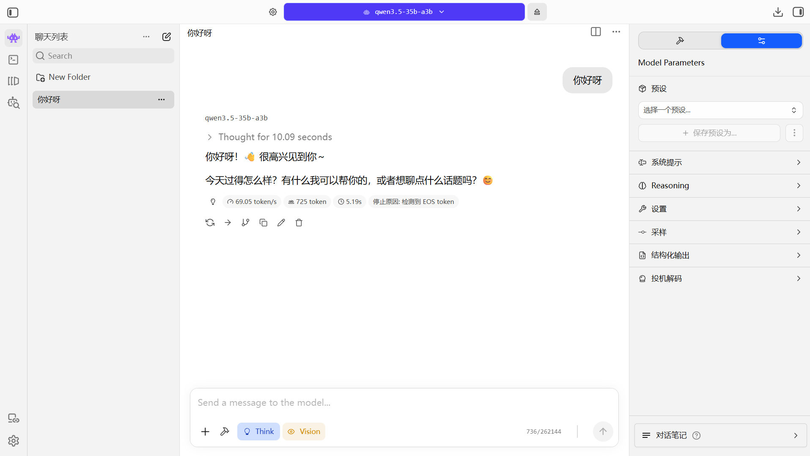
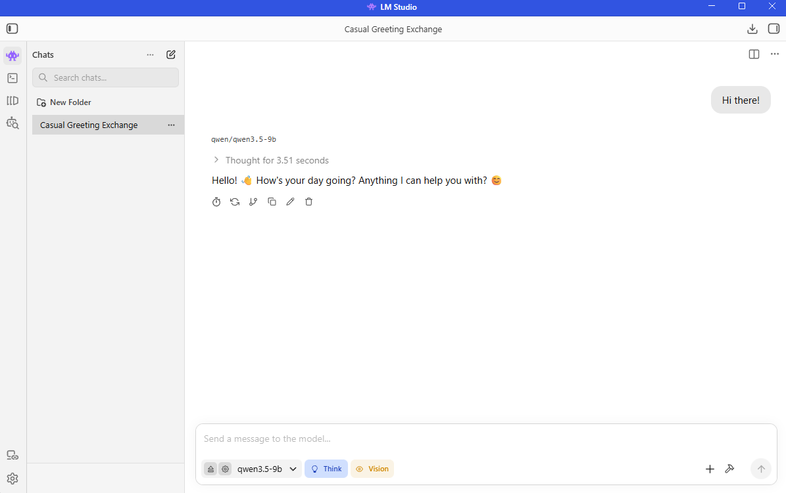

<!--
Copyright Advanced Micro Devices, Inc.

SPDX-License-Identifier: MIT
-->

<!-- @github-only -->
> [!IMPORTANT]
> 此 playbook 使用了 GitHub 无法渲染的特殊标签。请访问 [amd.com/playbooks](https://amd.com/playbooks) 正确预览此内容。
<!-- @github-only:end -->

## 概述

LM Studio 是一个功能强大的图形界面工具，底层封装了 [llama.cpp](https://github.com/ggml-org/llama.cpp)，同时也提供用于本地模型服务的[兼容 OpenAI 的端点](https://lm-studio.cn/docs/developer/openai-compat)。LM Studio 提供了简单而强大的界面，便于下载和部署模型。对于 AMD 用户，LM Studio 同时提供 Vulkan 和 AMD ROCm™ software 后端（在 LM Studio 中称为 runtimes）。


## 你将学到什么
- 如何配置并使用 LM Studio 充分利用本地硬件
- 如何在完全离线的环境中测试和管理 LLM
- 如何通过兼容 OpenAI 的 API 提供模型服务，为自定义工作流和应用提供支持


## 设置内存配置

<!-- @require:memory-config -->

<!-- @device:halo_box -->
## 检查软件更新

<!-- @os:linux -->
> **注意**：你可以通过 AMD Ryzen™ AI Developer Center 安装 VS Code。LM Studio 请按照下面的安装说明操作。
<!-- @os:end -->

<!-- @os:windows -->
> **注意**：如果尚未安装 VS Code 或 LM Studio，可以从 AMD Ryzen™ AI Developer Center 安装。
<!-- @os:end -->

<!-- @require:software-update -->
<!-- @device:end -->

## 安装软件先决条件

<!-- @device:rx7900xt,rx9070xt,r9700 -->
<!-- @require:driver -->
<!-- @device:end -->

<!-- @require:lmstudio -->

## 下载模型

<!-- @var:id=lms_model device=halo,halo_box value="qwen3.5-35b-a3b" -->
<!-- @var:id=lms_model device=stx,krk,rx7900xt,rx9070xt,r9700 value="qwen3.5-9b" -->
<!-- @var:id=model_name device=halo,halo_box value="Qwen3.5-35B-A3B" -->
<!-- @var:id=model_name device=stx,krk,rx7900xt,rx9070xt,r9700 value="Qwen3.5 9B" -->

<!-- @device:halo,halo_box -->
<!-- @require:lmstudio-models-qwen3-35b-a3b -->
<!-- @device:end -->

<!-- @device:stx,krk,rx7900xt,rx9070xt,r9700 -->
<!-- @require:lmstudio-models-qwen3-9b -->
<!-- @device:end -->

## 与 LLM 聊天
了解如何完全在本地启动并使用接近 ChatGPT 体验的 LLM。  

1. 打开 LMStudio。
2. 按 `Ctrl + L` 打开 Model Loader，选择 `Manually choose model load parameters`，然后点击 `${model_name}`
3. 确认已勾选 `show advanced settings`。
4. 按需调整 `Context Length`。上下文长度越高，模型可使用的上下文越长，但也会占用更多系统内存。本 playbook 推荐设置为 4096。
5. 确认 `GPU Offload` 设置为最大，并将 `Flash Attention` 打开（Cache Quantizations 可以保持关闭）
6. 勾选 `Remember settings`，然后点击 `Load Model`。
7. 如果当前不在聊天窗口，请按 `Ctrl + 1`，或点击屏幕左上角的 👾 按钮。
8. 发送一条消息，开始与模型交互！

<!-- @os:windows -->
<!-- @test:id=lmstudio-select-gpu-runtime-windows timeout=120 hidden=True -->
```powershell
# CI: pin a GPU (Vulkan) runtime so tests don't fall back to the CPU engine.
lms runtime ls
$rt = ((lms runtime ls) -match 'vulkan' | Select-Object -First 1)
if ($rt) {
  lms runtime select (($rt.Trim() -split '\s+')[0])
  lms runtime ls | Select-String 'ENGINE|✓'
} else {
  Write-Output "WARNING: no Vulkan runtime installed; GPU acceleration unavailable. Install with: lms get <vulkan-runtime>"
}
```
<!-- @test:end -->
<!-- @os:end -->

<!-- @os:windows -->
<!-- @test:id=lmstudio-load-model-windows timeout=1200 hidden=True -->
```powershell
lms unload --all
lms ps
$ID = "${lms_model}-$env:GITHUB_RUN_ID"
Set-Content -Path "$env:TEMP\lmstudio_model_id.txt" -Value $ID -Encoding utf8
# retry once: large-model loads can transiently fail under memory pressure
lms load ${lms_model} --context-length 32768 --gpu max --identifier "$ID" -y
if ($LASTEXITCODE -ne 0) { lms unload --all; Start-Sleep 5; lms load ${lms_model} --context-length 32768 --gpu max --identifier "$ID" -y }
lms ps
lms chat "$ID" -p "Reply with exactly: OK"
```
<!-- @test:end -->
<!-- @os:end -->

<!-- @os:linux -->
<!-- @test:id=lmstudio-select-gpu-runtime-linux timeout=120 hidden=True -->
```bash
# CI: pin a GPU (Vulkan) runtime so tests don't fall back to the CPU engine.
lms runtime ls
GPU_RT="$(lms runtime ls 2>/dev/null | awk '/vulkan/{print $1; exit}')"
if [ -n "$GPU_RT" ]; then
  lms runtime select "$GPU_RT"
  lms runtime ls | grep -E 'ENGINE|✓'
else
  echo "WARNING: no Vulkan runtime installed; GPU acceleration unavailable. Install with: lms get <vulkan-runtime>"
fi
```
<!-- @test:end -->
<!-- @os:end -->

<!-- @os:linux -->
<!-- @test:id=lmstudio-load-model-linux timeout=1200 hidden=True -->
```bash
lms unload --all || true
lms ps
ID="${lms_model}-${GITHUB_RUN_ID}"
echo "$ID" > /tmp/lmstudio_model_id.txt
# retry once: large-model loads can transiently fail under memory pressure
lms load ${lms_model} --context-length 32768 --gpu max --identifier "$ID" -y || { lms unload --all; sleep 5; lms load ${lms_model} --context-length 32768 --gpu max --identifier "$ID" -y; }
lms ps # Verify model is really loaded
lms chat "$ID" -p "Reply with exactly: OK"
```
<!-- @test:end -->
<!-- @os:end -->

<!-- @device:halo,halo_box -->
<p align="center">
  
</p>
<!-- @device:end -->

<!-- @device:stx,krk,rx7900xt,rx9070xt,r9700 -->
<p align="center">
  
</p>
<!-- @device:end -->

> **提示**：Context Length 指模型可使用的上下文长度。Flash Attention 可以提升处理速度并降低内存占用。GPU Offload 会把计算转移到显卡上，从而更快生成响应。

## 通过兼容 OpenAI 的端点提供 LLM 服务

LM Studio 还通过 LM Studio Server 提供兼容 OpenAI 的端点。使用 Cline 的 agentic coding 工作流中已经演示过这一能力，详情请见[这里](../playbooks/vscode-qwen3-coder)。另一个常见用法，是通过向推理端点发送标准 HTTP 请求，把 LM Studio Server 接入任意 Web 应用（React、Node.js、Python）。

按照以下步骤设置 LM Studio Server：

1. 在左侧点击 `Developer` 标签（命令行图标），或按 `Ctrl + 2`，然后点击 `Server Settings`。
2. （可选）如果希望在局域网内提供模型服务，请勾选 `Serve on Local Network`。如果需要在网站中使用，或在 VS Code 中进行大量调用，请勾选 `Enable CORS`。
3. 在左上角，点击 `Status` 前方的开关按钮，确认 server 正在运行。
4. 一个兼容 OpenAI 的端点现在已经启动。地址通常是 http://127.0.0.1:1234
5. 如果尚未加载模型，可以点击 `Load Model`，并按照前文步骤加载模型。

<!-- @os:windows -->
<!-- @test:id=lmstudio-server-up-windows timeout=120 hidden=True -->
```powershell
lms server start --port 1234
curl.exe -s http://127.0.0.1:1234/v1/models
```
<!-- @test:end --> 
<!-- @os:end -->

<!-- @os:linux -->
<!-- @test:id=lmstudio-server-up-linux timeout=120 hidden=True -->
```bash
lms server start --port 1234
curl -s http://127.0.0.1:1234/v1/models
```
<!-- @test:end --> 
<!-- @os:end -->


现在，可以通过 LM Studio Server 端点访问该模型，并且它支持以下 OpenAI endpoints：

| 端点 | 方法 | 文档 |
|------------|----------|----------|
| /v1/models | GET | [Models](https://lm-studio.cn/docs/developer/openai-compat/models) |
| /v1/responses | POST | [Responses](https://lm-studio.cn/docs/developer/openai-compat/responses) |
| /v1/chat/completions | POST |	[Chat Completions](https://lm-studio.cn/docs/developer/openai-compat/chat-completions) |
| /v1/embeddings | POST | [Embeddings](https://lm-studio.cn/docs/developer/openai-compat/embeddings) |
| /v1/completions | POST | [Completions](https://lm-studio.cn/docs/developer/openai-compat/completions) |


#### 示例：Ping 你的端点
创建兼容 OpenAI 的端点后，我们来看如何把它集成到 Python 开发环境（例如 VSCode）中，并把你的系统作为本地 API provider 使用。

1. 创建 Python 虚拟环境：

<!-- @os:linux -->
<!-- @device:halo_box -->
    在 Linux 上，在你选择的目录中打开终端，然后运行以下命令创建 venv。
    ```bash
    sudo apt update
    sudo apt install -y python3-venv
    python3 -m venv lmstudio-env --system-site-packages
    source lmstudio-env/bin/activate
    ```
<!-- @device:end -->

<!-- @device:halo,stx,krk,rx7900xt,rx9070xt,r9700 -->
**授予当前用户访问 GPU 设备的权限**（注销并重新登录后生效）：

```bash
sudo usermod -aG render,video $LOGNAME
```

    在 Linux 上，在你选择的目录中打开终端，然后运行以下命令创建 venv。
    ```bash
    sudo apt update
    sudo apt install -y python3-venv
    python3 -m venv lmstudio-env
    source lmstudio-env/bin/activate
    ```
<!-- @device:end -->
<!-- @os:end -->

<!-- @os:windows -->
<!-- @device:halo_box -->
    在 Windows 上，在你选择的目录中打开终端，然后运行以下命令创建 venv。
    ```bash
    python -m venv lmstudio-env --system-site-packages
    lmstudio-env\Scripts\activate
    ```

    > **提示**：Windows 用户在运行某些 PowerShell 命令前，可能需要修改 PowerShell 执行策略，例如设置为 RemoteSigned 或 Unrestricted。

<!-- @device:end -->

<!-- @device:halo,stx,krk,rx7900xt,rx9070xt,r9700 -->
    在 Windows 上，在你选择的目录中打开终端，然后运行以下命令创建 venv。
    ```bash
    python -m venv lmstudio-env
    lmstudio-env\Scripts\activate
    ```

    > **提示**：Windows 用户在运行某些 PowerShell 命令前，可能需要修改 PowerShell 执行策略，例如设置为 RemoteSigned 或 Unrestricted。

<!-- @device:end -->
<!-- @os:end -->

2. 安装 OpenAI 包
    ```bash
    pip install openai
    ```

3. 运行以下脚本，ping 刚刚创建的端点。
    ```python
    from openai import OpenAI

    # Initialize the client specifically for your local server
    # The API key is required by the library but ignored by LM Studio
    client = OpenAI(
        base_url="http://localhost:1234/v1", 
        api_key="lm-studio"
    )
    print("Attempting to connect to local LM Studio server...")

    try:
        # Create a simple chat completion request
        completion = client.chat.completions.create(
            model="local-model", # The model identifier is optional in local mode
            messages=[
                {"role": "system", "content": "You are a helpful coding assistant."},
                {"role": "user", "content": "Explain Python decorators in 1 sentence"}
            ],
            temperature=0.7,
        )
        # Print the response
        print("\nConnection Successful! Server Response:\n")
        print(completion.choices[0].message.content)

    except Exception as e:
        print(f"\nConnection Failed: {e}. Ensure LM Studio server is running on port 1234.")
    ```
<!-- @os:windows -->
<!-- @test:id=lmstudio-ping-endpoint-windows timeout=300 hidden=True -->
```python
import json, urllib.request, os

model_id_path = os.path.join(os.environ["TEMP"], "lmstudio_model_id.txt")
with open(model_id_path, "r", encoding="utf-8") as f:
    model_id = f.read().strip()

req = urllib.request.Request(
 "http://127.0.0.1:1234/v1/chat/completions",
 data=json.dumps({
   "model": model_id,
   "messages": [{"role":"user","content":"What is 2 + 2? Reply with only the number."}],
   "temperature": 0,
   "max_tokens": 64
 }).encode("utf-8"),
 headers={"Content-Type":"application/json"},
 method="POST",
)
with urllib.request.urlopen(req, timeout=120) as r:
 print(r.read().decode("utf-8", "replace"))
```
<!-- @test:end --> 
<!-- @os:end -->

<!-- @os:linux -->
<!-- @test:id=lmstudio-ping-endpoint-linux timeout=300 hidden=True -->
```python
import json, urllib.request

with open("/tmp/lmstudio_model_id.txt", "r", encoding="utf-8") as f:
    model_id = f.read().strip()

req = urllib.request.Request(
 "http://127.0.0.1:1234/v1/chat/completions",
 data=json.dumps({
   "model": model_id,
   "messages": [{"role":"user","content":"What is 47 + 42? Reply with only the number in words."}],
   "temperature": 0,
   "max_tokens": 64
 }).encode("utf-8"),
 headers={"Content-Type":"application/json"},
 method="POST",
)
with urllib.request.urlopen(req, timeout=120) as r:
 print(r.read().decode("utf-8", "replace"))
```
<!-- @test:end --> 
<!-- @os:end -->

<!-- @os:windows -->
<!-- @test:id=lmstudio-server-stop-windows timeout=300 hidden=True -->
```powershell
$ID = Get-Content "$env:TEMP\lmstudio_model_id.txt" -Raw
$ID = $ID.Trim()
lms unload "$ID"
lms ps
lms server stop
```
<!-- @test:end -->
<!-- @os:end -->

<!-- @os:linux -->
<!-- @test:id=lmstudio-server-stop-linux timeout=300 hidden=True -->
```bash
ID="$(cat /tmp/lmstudio_model_id.txt)"
lms unload "$ID" || true
lms ps
lms server stop
```
<!-- @test:end --> 
<!-- @os:end -->

#### （可选）在不同 Runtime 之间切换

1. 按键盘上的 `Ctrl + Shift + R`。也可以点击左侧的 `Discover` 标签（放大镜图标），然后在弹出窗口中点击 `Runtime`。
2. 你会看到 `Runtime Selections`，可以使用下拉菜单切换 runtime。


## 后续步骤

- **自定义应用集成**：使用本地兼容 OpenAI 的 API，将你自己的 Python 脚本或应用接入。
- **高级前端**：将 Open WebUI 等强大的界面连接到 server，用于聊天历史和角色管理。

更多文档请访问：https://lm-studio.cn/docs/developer
