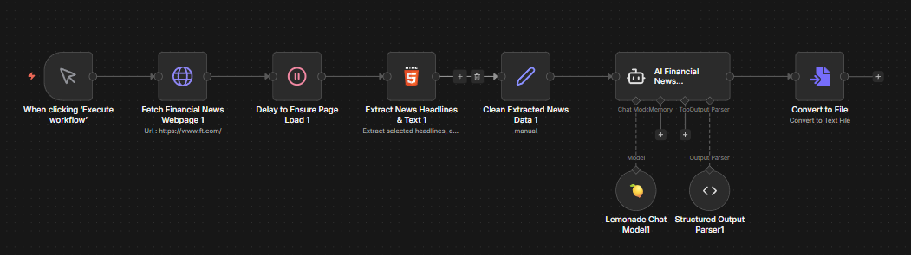

<!--
Copyright Advanced Micro Devices, Inc.

SPDX-License-Identifier: MIT
-->

<!-- @github-only -->
> [!IMPORTANT]
> 此 playbook 使用了 GitHub 无法渲染的特殊标签。请访问 [amd.com/playbooks](https://amd.com/playbooks) 正确预览此内容。
<!-- @github-only:end -->

## 概述

<!-- @device:stx,krk,rx7900xt,rx9070xt,r9700 -->
> [!NOTE]
> 此 playbook 至少需要 **32GB** 系统内存。
<!-- @device:end -->

n8n 是一个工作流自动化平台，可让你通过可视化的节点编辑器连接各种应用和服务。

本 playbook 将指导你搭建一个由 AI 驱动的财经新闻摘要器。它会抓取新华网财经频道，提取关键标题，并使用本机运行的本地 LLM 生成面向投资者的摘要。

## 你将学到什么

- 如何安装并启动 n8n
- 如何导入并配置预构建工作流
- 如何使用 n8n 原生集成连接 Lemonade
- 如何理解工作流节点和数据流

## 什么是 Lemonade？

[Lemonade](https://lemonade-server.ai) 是一个面向 AMD 硬件构建的本地 LLM 服务平台。它提供兼容 OpenAI 的 API，并完全在你的本机运行，因此你的数据不会离开你的设备。

在本 playbook 中，我们使用 Lemonade 提供本地 LLM 服务，n8n 会连接到它来完成 AI 驱动的任务。

n8n 包含一个**原生 Lemonade 节点**（`Lemonade Chat Model`），可提供一等集成体验，无需手动配置。这让把本地 LLM 接入自动化工作流变得更直接。

## 设置内存配置

<!-- @require:memory-config -->

<!-- @device:halo_box -->
## 检查软件更新

<!-- @require:software-update -->
<!-- @device:end -->

## 安装软件先决条件
<!-- @device:rx7900xt,rx9070xt,r9700 -->
<!-- @require:driver -->
<!-- @device:end -->

<!-- @os:windows -->
<!-- @require:lemonade,nodejs -->
<!-- @os:end -->

<!-- @os:linux -->
<!-- @require:lemonade,podman -->
<!-- @os:end -->

<!-- @device:halo,halo_box -->
<!-- @var:id=lemonade_model value="Qwen3.5-35B-A3B-GGUF" -->
<!-- @device:end -->

<!-- @device:stx,krk,rx7900xt,rx9070xt,r9700 -->
<!-- @var:id=lemonade_model value="Qwen3.5-9B-GGUF" -->
<!-- @device:end -->


<!-- @test:id=lemonade-version timeout=60 hidden=True -->
```bash
lemonade --version
```
<!-- @test:end -->

<!-- @os:windows -->
<!-- @test:id=lemonade-chat-windows timeout=1200 hidden=True -->
```powershell
$ErrorActionPreference = "Stop"

# Wait for server to come up
$modelsJson = $null
for ($i=0; $i -lt 120; $i++) {
  $modelsJson = curl.exe -s --max-time 2 http://127.0.0.1:13305/api/v1/models
  if ($modelsJson) { break }
  Start-Sleep -Seconds 1
}
if (-not $modelsJson) { throw "Lemonade server not ready on http://127.0.0.1:13305" }
Write-Host "OK: Lemonade server is responding"

# Now that the server is responding, check if model is downloaded in Lemonade (robust JSON parse)
$parsed = $modelsJson | ConvertFrom-Json
$entry  = $parsed.data | Where-Object { $_.id -eq "${lemonade_model}" } | Select-Object -First 1
if (-not $entry) { throw "Model ${lemonade_model} is not present in Lemonade /api/v1/models." }
if (-not $entry.downloaded) { throw "Model ${lemonade_model} is present but not downloaded in Lemonade. Please download it." }
Write-Host "OK: ${lemonade_model} model is downloaded in Lemonade"

# Model chat test
$body = @{
  model = "${lemonade_model}"
  messages = @(@{ role = "user"; content = "Reply with exactly: OK" })
  temperature = 0
  max_tokens = 32
} | ConvertTo-Json -Depth 5

$tmpBody = Join-Path $env:TEMP "lemonade-chat-body.json"
[System.IO.File]::WriteAllText($tmpBody, $body, [System.Text.UTF8Encoding]::new($false))

try {
  $out = curl.exe -sS --fail-with-body --max-time 300 http://127.0.0.1:13305/api/v1/chat/completions `
  -H "Content-Type: application/json" `
  --data-binary "@$tmpBody"
  if (-not $out) { throw "Empty response from Lemonade chat/completions" }
}
finally {
  Remove-Item  $tmpBody -Force -ErrorAction SilentlyContinue
}
```
<!-- @test:end -->
<!-- @os:end -->


<!-- @os:linux -->
<!-- @test:id=lemonade-chat-linux timeout=1200 hidden=True -->
```bash
set -euo pipefail

models_json=""
for i in $(seq 1 120); do
  models_json="$(curl -s --max-time 2 http://127.0.0.1:13305/api/v1/models || true)"
  if [ -n "$models_json" ]; then
    break
  fi
  sleep 1
done

if [ -z "$models_json" ]; then
  echo "Lemonade server not ready on http://127.0.0.1:13305"
  exit 1
fi
echo "OK: Lemonade server is responding"

export MODELS_JSON="$models_json"
python3 - <<'PY'
import json
import os
import sys

data = json.loads(os.environ["MODELS_JSON"])
entry = None
for item in data.get("data", []):
    if item.get("id") == "${lemonade_model}":
        entry = item
        break

if entry is None:
    print("Model ${lemonade_model} is not present in Lemonade /api/v1/models.")
    sys.exit(1)

if not entry.get("downloaded", False):
    print("Model ${lemonade_model} is present but not downloaded in Lemonade. Please download it.")
    sys.exit(1)

print("OK: ${lemonade_model} model is downloaded in Lemonade")
PY

body='{
  "model": "${lemonade_model}",
  "messages": [{"role": "user", "content": "Reply with exactly: OK"}],
  "temperature": 0,
  "max_tokens": 32
}'

out="$(curl -sS --fail-with-body --max-time 300 http://127.0.0.1:13305/api/v1/chat/completions \
  -H "Content-Type: application/json" \
  -d "$body" || true)"

if [ -z "$out" ]; then
  echo "Empty response from Lemonade chat/completions"
  exit 1
fi
```
<!-- @test:end -->
<!-- @os:end -->

<!-- @test:id=node-npm-version timeout=60 hidden=True -->
```bash
node -v
npm -v
```
<!-- @test:end -->

## 安装 n8n
<!-- @os:windows -->
使用 npm 全局安装 n8n。

> **注意**：你可能会看到一些 npm 警告，这是正常现象。

```bash
npm install -g n8n
```

<!-- @test:id=n8n-version timeout=60 hidden=True -->
```bash
n8n --version
```
<!-- @test:end -->
<!-- @os:end -->

<!-- @os:linux -->
<!-- @test:id=n8n-version timeout=60 hidden=True -->
```bash
export PATH="$HOME/.npm-global/bin:$HOME/.local/bin:$PATH"
n8n --version
```
<!-- @test:end -->
<!-- @os:end -->

<!-- @os:windows -->
> **提示**：Windows 用户在运行某些 PowerShell 命令前，可能需要修改 PowerShell 执行策略，例如设置为 RemoteSigned 或 Unrestricted。
<!-- @os:end -->


<!-- @os:windows -->
> **PATH 问题**：如果 `n8n --version` 提示找不到命令，请确认 npm 全局 bin 目录已经加入用户 `PATH`。通常安装路径是 `C:\Users\<username>\AppData\Roaming\npm`。
> 将其加入用户路径（编辑系统环境变量 > 环境变量 > 编辑用户路径）后，重新打开终端。

<!-- @os:end -->

<!-- @os:linux -->
接下来，我们会使用 Podman service 将 n8n 容器化运行。

请将以下文件下载到你选择的目录：[compose.yml](assets/compose.yml)

在该目录中运行：
```bash
podman compose up -d
```

这会安装 n8n，并把数据写入持久化存储。

在浏览器地址栏输入 `localhost:5678` 即可启动 n8n。
<!-- @os:end -->

<!-- @os:windows -->
## 启动 n8n

从终端启动 n8n：

```bash
n8n start
```

<!-- @test:id=n8n-start-windows timeout=300 hidden=True -->
```powershell
$N8N_CMD = "$env:APPDATA\npm\n8n.cmd"
$p = Start-Process -FilePath "cmd.exe" -ArgumentList "/c `"$N8N_CMD`" start" -NoNewWindow -PassThru
try {
  $ok = $false
  for ($i=0; $i -lt 120; $i++) {
    # Check HTTP status code only (body may be empty)
    $code = curl.exe -s -o NUL -w "%{http_code}" --max-time 2 http://127.0.0.1:5678/healthz
    if ($LASTEXITCODE -eq 0 -and $code -eq "200") { $ok = $true; break }
    Start-Sleep -Seconds 1
  }
  if (-not $ok) { throw "n8n not ready on http://127.0.0.1:5678/healthz" }
  Write-Host "OK: n8n server is responding"
} finally {
  # Kill the process actually listening on 5678
  $conn = Get-NetTCPConnection -LocalPort 5678 -State Listen -ErrorAction SilentlyContinue | Select-Object -First 1
  if ($conn) { Stop-Process -Id $conn.OwningProcess -Force -ErrorAction SilentlyContinue }
  # Also kill wrapper pid just in case
  if ($p -and -not $p.HasExited) { Stop-Process -Id $p.Id -Force -ErrorAction SilentlyContinue }
}
```
<!-- @test:end -->
<!-- @os:end -->

<!-- @os:linux -->
<!-- @test:id=n8n-start-linux timeout=300 hidden=True -->
```bash
set -euo pipefail

export PATH="$HOME/.npm-global/bin:$HOME/.local/bin:$PATH"
p=""
cleanup() {
  if [ -n "${p:-}" ] && kill -0 "$p" 2>/dev/null; then
    kill "$p" 2>/dev/null || true
    sleep 2
    kill -9 "$p" 2>/dev/null || true
  fi
}
trap cleanup EXIT

n8n start >/tmp/n8n-test.log 2>&1 &
p=$!

ok=false
for i in $(seq 1 120); do
  code="$(curl -s -o /dev/null -w "%{http_code}" --max-time 2 http://127.0.0.1:5678/healthz || true)"
  if [ "$code" = "200" ]; then
    ok=true
    break
  fi
  sleep 1
done

if [ "$ok" != "true" ]; then
  echo "n8n not ready on http://127.0.0.1:5678/healthz"
  exit 1
fi

echo "OK: n8n server is responding"
```
<!-- @test:end -->
<!-- @os:end -->

<!-- @os:windows -->
n8n 会启动一个本地 Web 服务器。按 `'o'`，或打开浏览器访问 `http://localhost:5678`，即可进入编辑器。
<!-- @os:end -->


> **提示**：使用 n8n 时请保持终端窗口打开。关闭终端可能会停止服务器。

## 启动 Lemonade

Lemonade 是运行模型并连接 n8n 的本地服务器。

<!-- @os:linux -->
点击任务栏中的 Lemonade 图标打开 Lemonade GUI。你可以在这里浏览模型和后端，并加载预安装模型。
<!-- @os:end -->

<!-- @os:windows -->
点击 Lemonade 图标打开 Lemonade GUI。右键单击托盘图标打开应用。之后，你可以添加模型、后端，并加载预安装模型。
<!-- @os:end -->

>**提示**：运行后，也可以通过 http://localhost:13305 访问 Lemonade GUI。

或者，你可以打开终端并运行 `lemonade list` 查看已安装模型。然后运行：

<!-- @device:halo_box -->
<!-- @os:linux -->
```bash
lemonade run Qwen3.5-35B-A3B-GGUF --llamacpp vulkan
```
<!-- @os:end -->

<!-- @os:windows -->
```powershell
lemonade run Qwen3.5-35B-A3B-GGUF --llamacpp vulkan
```
<!-- @os:end -->
<!-- @device:end -->

<!-- @device:halo -->
```bash
lemonade run Qwen3.5-35B-A3B-GGUF --llamacpp vulkan
```
<!-- @device:end -->

<!-- @device:stx,krk,rx7900xt,rx9070xt,r9700 -->
```bash
lemonade run Qwen3.5-9B-GGUF --llamacpp vulkan
```
<!-- @device:end -->

### 可选：使用 ModelScope 下载并加载本地 GGUF 模型

如果通过 Lemonade 默认源直接下载模型失败，可以让 Lemonade 从 ModelScope 源拉取对应的 GGUF 模型，然后再运行该模型。

<!-- @device:halo,halo_box -->
```bash
lemonade pull --source modelscope unsloth/Qwen3.5-35B-A3B-GGUF:Q4_K_M
lemonade run Qwen3.5-35B-A3B-GGUF-Q4_K_M --llamacpp vulkan
```
<!-- @device:end -->

<!-- @device:stx,krk,rx7900xt,rx9070xt,r9700 -->
```bash
lemonade pull --source modelscope unsloth/Qwen3.5-9B-GGUF-GGUF:Q4_K_M
lemonade run Qwen3.5-9B-GGUF-Q4_K_M --llamacpp vulkan
```
<!-- @device:end -->


## 设置工作流

### 步骤 1：注册或登录 n8n

首次打开 n8n 时，系统会提示你创建账户或登录：

1. 在浏览器中打开 `http://localhost:5678`
2. 使用邮箱创建新的本地账户；如果已有账户，则直接登录
3. 登录后，你会看到 n8n 仪表盘

> **提示**：如果账户被锁定，可以尝试运行 `n8n user-management:reset`

### 步骤 2：导入工作流

我们已经提供了一个可直接导入的预构建工作流：

1. 下载以下工作流文件：[financial-news-workflow.json](assets/financial-news-workflow.json)
2. 点击 **Start from Scratch** 打开工作流编辑器。或者点击左上角的 + 按钮，然后选择 **Add workflow**。
3. 点击右上角的 **...** 菜单（三个点），选择 **Import from file**
4. 选择已下载的 `financial-news-workflow.json` 文件
5. 工作流会出现在画布上


### 步骤 3：理解工作流

导入的工作流包含 9 个相互连接的节点：

<p align="center">
  
</p>

| 节点 | 用途 |
|------|---------|
| **When clicking 'Execute workflow'** | 手动触发器，用于启动工作流 |
| **Fetch Financial News Webpage** | 向 `https://www.news.cn/fortune/index.htm` 发送 HTTP GET 请求 |
| **Delay to Ensure Page Load** | 等待节点，确保页面内容完全加载 |
| **Extract News Headlines & Text** | HTML 节点，使用 CSS 选择器提取新华网财经新闻标题 |
| **Clean Extracted News Data** | Set 节点，将所有提取的数据合并到单个文本字段 |
| **AI Financial News Summarizer** | AI Agent，使用中文金融分析师系统提示词处理新闻 |
| **Lemonade Chat Model** | 连接到本地 Lemonade 服务器中运行的 LLM |
| **Structured Output Parser** | 将 AI 输出格式化为结构化 JSON |
| **Convert to File** | 将摘要转换为可下载文件 |

### 步骤 4：配置 Lemonade 凭据

运行工作流前，需要将它连接到本地 Lemonade 服务器：

1. 在 n8n 中双击 **Lemonade Chat Model** 节点
2. 在 **Credential to connect with** 下拉菜单中选择 **Create New Credential**
3. 输入下表中的值，然后点击保存。
4. 选择你已经在 Lemonade Server 中加载的对应模型。

  | 字段 | 值 |
  |-------|-------|
  | **Base URL** | `http://localhost:13305/api/v1` |
  | **API Key** | `lemonade` |

> **注意**：测试前，请在终端运行 `lemonade status`，确认 Lemonade server 正在运行。
<!-- @device:halo_box -->
> 此工作流使用 `Qwen3.5-35B-A3B-GGUF`，并已在 Lemonade 中预安装。你可以在 Lemonade Chat Model 节点设置中改用其他已加载模型。
<!-- @device:end -->

### 步骤 5：测试工作流

1. 确认 Lemonade 正在运行并已加载模型
2. 点击画布底部中央的 **Execute workflow**
3. 观察各节点从左到右依次执行；完成后节点会变为绿色
4. 双击 **AI Financial News Summarizer** 节点，在底部面板查看生成的摘要。
5. 双击 **Convert to File** 节点，在底部面板下载对应的文本文件。

## 理解 AI Agent

AI Financial News Summarizer 使用面向金融分析设计的中文系统提示词：

```text
你是一名 AI 财经分析师。你的职责是阅读、理解并总结今天的重要财经新闻。目标是为投资者提供清晰、简洁的市场概览，以支持更好的投资决策。

投资者展望
今天的新闻指向[偏多/偏空/中性]的市场情绪。请关注明天的[经济事件/财报]，这可能会影响市场方向。
```

该 Agent 接收清洗后的新闻数据，并输出带有市场情绪判断的结构化摘要。

### 保存工作流

如果需要，可以点击顶部的工作流名称并重命名。你操作过程中，工作流会自动保存。

## 后续步骤

- **安排自动化任务**：将 Manual Trigger 替换为 **Schedule Trigger**，让工作流每天运行
- **发送通知**：添加 **Discord**、**Slack** 或 **Email** 节点来接收摘要
- **尝试不同模型**：在 Lemonade Chat Model 节点中更改模型，试用不同 LLM
- **自定义提取内容**：修改 HTML Extract 节点的 CSS 选择器，定位不同新闻板块
- **尝试不同后端**：n8n 也支持 [Ollama](https://n8n.io/workflows/?integrations=Ollama+Chat+Model)、LM Studio 和其他本地 LLM 后端

### 探索 n8n 模板

n8n 提供数百个预构建工作流模板。你可以浏览官方模板库：

**[https://n8n.io/workflows/](https://n8n.io/workflows/)**

搜索 “AI”、“LLM” 或 “automation”，查找可导入并自定义的工作流。

更多信息请参阅 [n8n 文档](https://docs.n8n.io/)。

<!-- @os:linux -->
<!-- @test:id=lemonade-unload-linux timeout=60 hidden=True -->
```bash
# CI cleanup: unload the model so the GPU pool is free
lemonade unload || true
```
<!-- @test:end -->
<!-- @os:end -->

<!-- @os:windows -->
<!-- @test:id=lemonade-unload-windows timeout=60 hidden=True -->
```powershell
# CI cleanup: unload the model so the GPU pool is free
lemonade unload
exit 0
```
<!-- @test:end -->
<!-- @os:end -->
