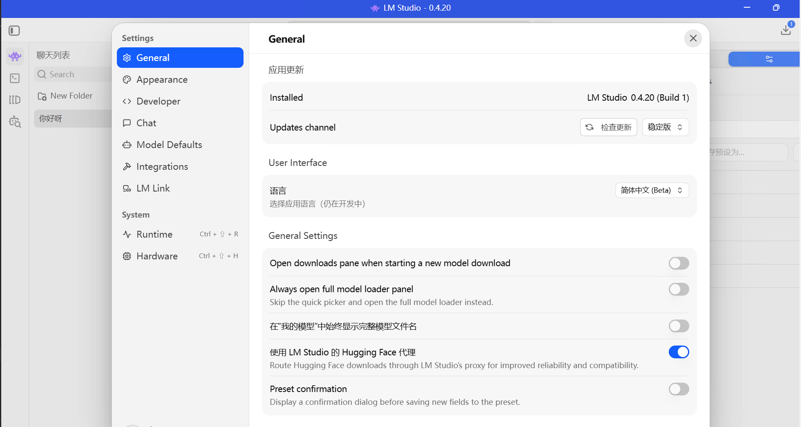
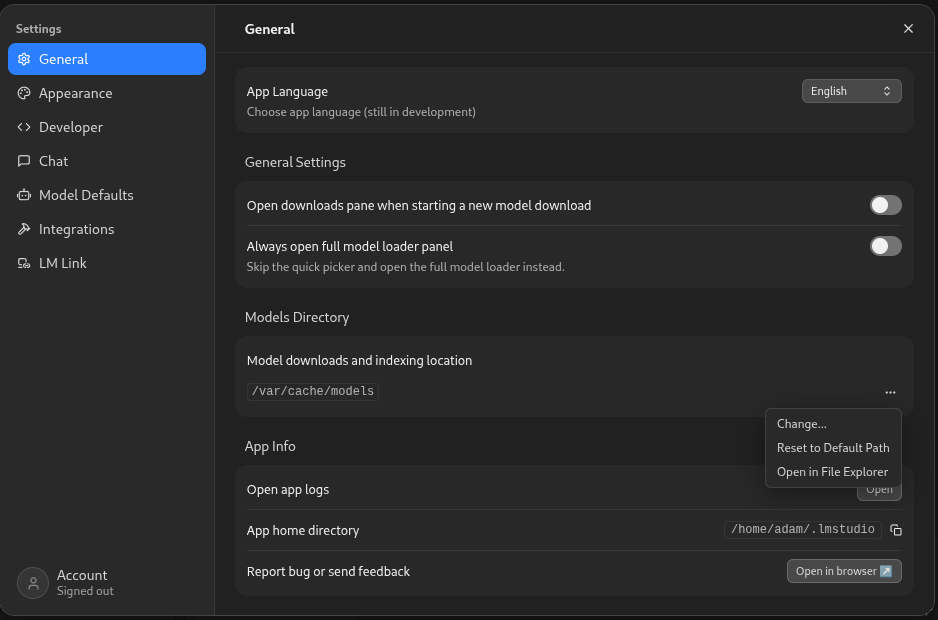

<!--
Copyright Advanced Micro Devices, Inc.

SPDX-License-Identifier: MIT
-->

### LM Studio
<!-- @os:windows -->

<!-- @device:halo_box -->
LM Studio 可以从 **AMD Ryzen™ AI Developer Center** 安装。进入 **Updates** 标签页，如果尚未安装 LM Studio，请安装它。

为了让 LM Studio 看到预安装模型，请进入 Settings > General > Models Directory。然后将路径改为 `C:\Users\Public\models`

<p align="center">
  
</p>
<!-- @device:end -->

<!-- @device:halo,stx,krk,rx7900xt,rx9070xt,r9700 -->
1. 从这里下载安装程序：[https://lm-studio.ai/download](https://lm-studio.ai/download)
2. 安装。
<!-- @device:end -->

> 提示：安装后，启动一次 LM Studio 来初始化 CLI（`lms`）。

<!-- @test:id=lmstudio-cli-windows timeout=60 hidden=True -->
```powershell
lms --help
```
<!-- @test:end -->
<!-- @os:end -->

<!-- @os:linux -->
> 注意：你可以选择安装 .deb 或 AppImage。
1. 从这里下载 AppImage：[https://lm-studio.ai/download?os=linux](https://lm-studio.ai/download?os=linux)
2. 运行 `sudo apt install libfuse2`
3. 运行 `cd ~/Downloads`
4. 运行 `chmod +x LM-Studio-*.AppImage`
5. 运行 `./LM-Studio-*.AppImage`
> 提示：安装后，启动一次 LM Studio 来初始化 CLI（`lms`）。

<!-- @device:halo_box -->
为了让 LM Studio 看到预安装模型，请进入 Settings > General > Models Directory。然后将路径改为 `/var/cache/models`。

<p align="center">
  
</p>
<!-- @device:end -->

<!-- @test:id=lmstudio-cli-linux timeout=60 hidden=True -->
```bash
lms --help
```
<!-- @test:end --> 
<!-- @os:end -->
