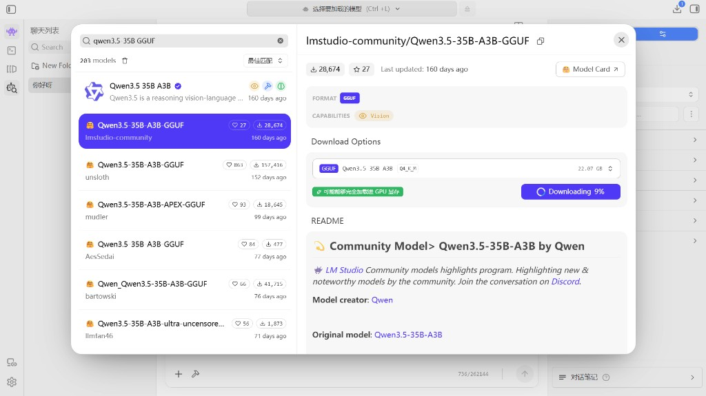

<!--
Copyright Advanced Micro Devices, Inc.

SPDX-License-Identifier: MIT
-->

### 在 LM Studio 中下载 Qwen3.5-35B-A3B

下载 Qwen3.5-35B-A3B 模型：

1. 在键盘上按 "Ctrl" + "Shift" + "M"，或点击左侧边栏的 "Discover" 标签页（放大镜图标）
2. 搜索 `lmstudio-community/Qwen3.5-35B-A3B-GGUF`
3. 选择一种量化格式（推荐的 `Q4_K_M` 在大小和质量之间取得较好平衡），然后点击 Download

<p align="center">
  
</p>

LM Studio 会自动下载模型并将其放到正确目录。

如果你希望下载其他模型，可以在 Discover 标签页中搜索，剩下的流程由 LM Studio 处理。

<!-- @os:windows -->
<!-- @test:id=lmstudio-model-present-qwen3-35b-a3b-windows timeout=60 hidden=True -->
```powershell
lms ls --llm | Select-String -Pattern "qwen3.5-35b-a3b"
```
<!-- @test:end -->
<!-- @os:end -->

<!-- @os:linux -->
<!-- @test:id=lmstudio-model-present-qwen3-35b-a3b-linux timeout=60 hidden=True -->
```bash
lms ls --llm | grep -i "qwen3.5-35b-a3b"
```
<!-- @test:end -->
<!-- @os:end -->
