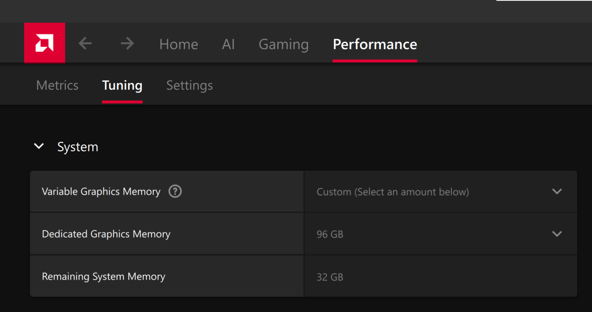
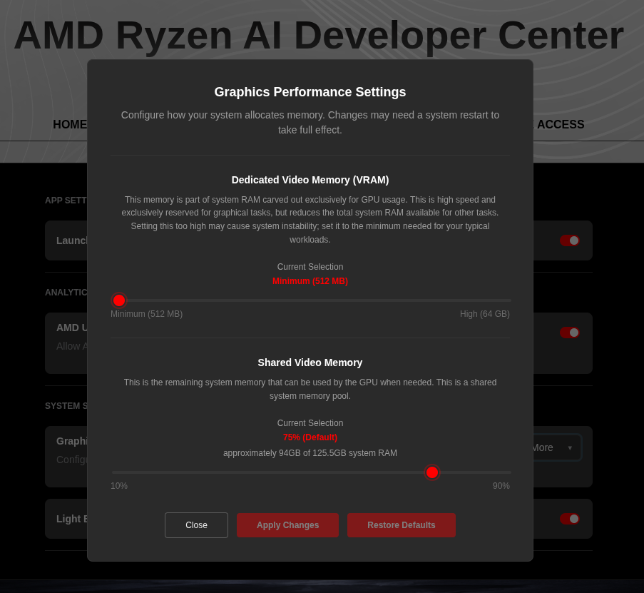

<!--
Copyright Advanced Micro Devices, Inc.

SPDX-License-Identifier: MIT
-->

<!-- @os:windows -->

<!-- @device:halo_box -->

对于 Ryzen AI Halo，专用 GPU 内存默认值为 64GB，足以满足大多数工作负载。对于更大的模型或更长的上下文，将其提高到 96GB 可能会有所帮助。要调整此设置，请打开 **AMD Software: Adrenalin Edition™**，进入 **Performance → Tuning → AMD Variable Graphics Memory**。重启后更改才会生效。

<p align="center">
  
</p>

<!-- @device:end -->

<!-- @device:halo,stx,krk -->

要更改专用 GPU 内存值，请打开 **AMD Software: Adrenalin Edition™**，进入 **Performance → Tuning → AMD Variable Graphics Memory**。重启后更改才会生效。

<p align="center">
  
</p>

<!-- @device:end -->

<!-- @os:end -->

<!-- @os:linux -->

在 Linux 上，如需运行更大的模型，请增加 GPU 可用的**共享内存**池。这可能需要将 BIOS 中的专用 GPU 内存设置为最小值，以便最大化共享内存池。

<!-- @device:halo_box -->

对于 AMD Ryzen™ AI Halo，默认共享内存为 96GB。要修改此设置，请打开 **AMD Ryzen™ AI Developer Center**，进入 **Settings** 标签页。在 **Graphics Performance Settings** 下调高 **Shared Video Memory** 滑块，然后点击 **Apply Changes** 并重启，使更改生效。

<p align="center">
  
</p>

<!-- @device:end -->

<!-- @device:halo,stx,krk -->

通过更改内核 Translation Table Manager (TTM) 页面设置来增加共享内存池。AMD 建议在 BIOS 中将最小专用 VRAM 设置为 0.5 GB，以便尽可能多地将内存作为共享内存使用。

1. 安装 `pipx` 工具，并将 pipx 安装的 wheel 路径添加到系统搜索路径：

   ```bash
   sudo apt install pipx
   pipx ensurepath
   ```

2. 从 PyPI 安装 `amd-debug-tools` wheel：

   ```bash
   pipx install amd-debug-tools
   ```

3. 查询当前共享内存设置：

   ```bash
   amd-ttm
   ```

4. 增加共享内存分配量（单位为 GB）：

   ```bash
   amd-ttm --set <NUM>
   ```

5. 重启以使更改生效。

<!-- @device:end -->

<!-- @os:end -->
