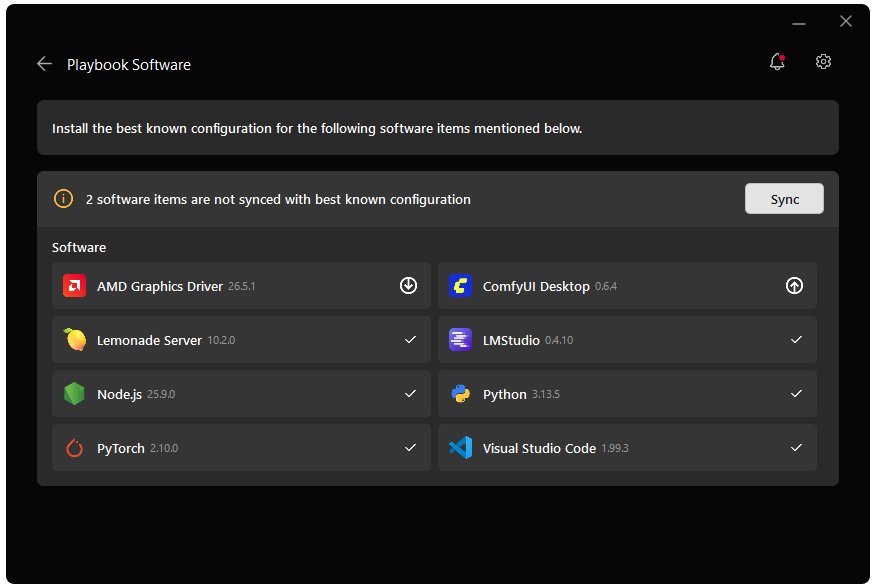
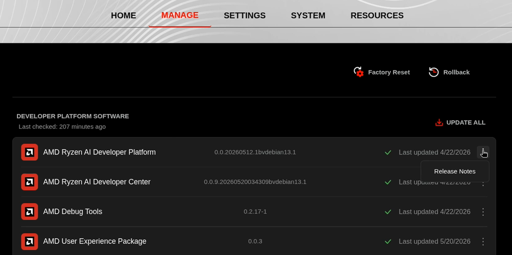

<!--
Copyright Advanced Micro Devices, Inc.

SPDX-License-Identifier: MIT
-->

<!-- @device:halo_box -->

开始之前，请确认你的 Ryzen AI Halo 已安装最新软件。打开 **AMD Ryzen™ AI Developer Center**，检查应用本身以及其他软件是否有可用更新。

<!-- @os:windows -->

进入 **Updates** 标签页。如果有可用更新，请安装并重启后再继续。

  

<!-- @os:end -->

<!-- @os:linux -->

进入 **Manage** 标签页。如果有可用更新，请安装并重启后再继续。

  

<!-- @os:end -->

<!-- @device:end -->
